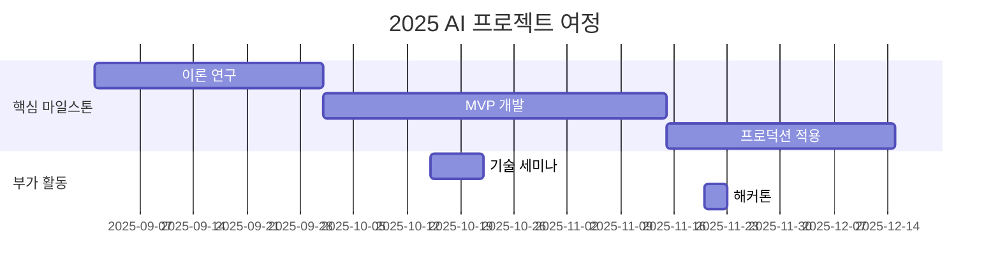

# LLM_AI_app

<h1 align="center"> LLM_AI_app </h1>

<div align="center">
<a href="https://pseudo-lab.com"></a>
<a href="https://discord.gg/EPurkHVtp2"></a>
<a href="https://github.com/Pseudo-Lab/10th-template/stargazers"></a>
<a href="https://github.com/Pseudo-Lab/10th-template/network/members"></a>
<a href="https://github.com/Pseudo-Lab/10th-template/pulls"></a>
<a href="https://github.com/Pseudo-Lab/10th-template/issues"></a>
<a href="https://github.com/Pseudo-Lab/10th-template/graphs/contributors"></a>
<a href="https://hits.seeyoufarm.com"></a>
</div>
<br>

<!-- sheilds: https://shields.io/ -->
<!-- hits badge: https://hits.seeyoufarm.com/ -->

> Welcome to the LLM_AI_app repository! Our goal is to explore the fundamentals of LLM with RAG to develop AI services, providing tools and frameworks for RAG and chatbots. Join us in advancing the field of LLM through open collaboration and innovation!

## 🌟 프로젝트 목표 (Project Vision)
_"기초부터 실습까지, 함께 성장하는 LLM 실험실"_  
- LLM의 개념, 원리, 사례 & LangChain 사용법 탐구
- 개인 성장과 집단 지혜의 시너지 창출
- 오픈소스 정신을 바탕으로 한 지식 공유 문화
- 실패를 성공의 디딤돌로 만드는 실험적 접근


## 🧑 역동적인 팀 소개 (Dynamic Team)

| 역할          | 이름 |  기술 스택 배지                                                                 | 주요 관심 분야                          |
|---------------|------|-----------------------------------------------------------------------|----------------------------------------|
| **Project Manager** | 권선옥 |   | LLM/NLP             |
| **Member** | 레오나르도 다빈치 |   | 데이터 파이프라인 설계                  |


## 🚀 프로젝트 로드맵 (Project Roadmap)



## 🛠️ 우리의 개발 문화 (Our Development Culture)
**우리의 개발 문화**  
```python
class CollaborationFramework:
    def __init__(self):
        self.tools = {
            'communication': 'Discord',
            'version_control': 'GitHub Projects',
            'ci/cd': 'GitHub Actions',
            'docs': 'Github Wiki'
        }
    
    def workflow(self):
        return """주간 사이클:
        1️⃣ 스터디 내용 발표 : 요약 + 코드 설명
        2️⃣ 스터디 내용 리뷰 : 더 공부하고 싶은 내용, 이슈, 어려웠던 점 등 공유 """
```


## 📈 성과 지표 (Achievement Metrics)
**2024 주요 KPI**  
| 지표                     | 목표치 | 현재 달성률 |
|--------------------------|--------|-------------|
| 커밋 수                  | 각자 매주 1회  | 0%         |


## 💻 주차별 활동 (Activity History)

| 날짜 | 내용 | 발표자 | 
| -------- | -------- | ---- |
| 2025/03/04 | OT       | ALL |
| 2025/03/11 |  1.1 LLM 개념 ~ 1.2 LLM 특징과 종류 | 미정 | 
| 2025/03/18 |  1.3 LLM 생성 과정 ~ 1.4 LLM 생성 후 추가 고려 사항 | 미정 | 
| 2025/03/25 |  2.1 LLM 활용 방법 ~ 2.3 LLM의 한계 | 미정 | 
| 2025/04/01 |  3.1 RAG 개념 ~ 3.2 RAG 구현 과정 | 미정 | 
| 2025/04/08 |  3.3 RAG 구현 시 필요한 것 | 미정 | 
| 2025/04/15 |  4.1 랭체인 훑어보기, 4.3 랭체인 주요 모듈 (✅ 4.2 랭체인을 사용하기 위한 환경 구성은 모든 구성원 전체 수행) | 미정 | 
| 2025/04/22 |  5.1 간단한 챗봇 만들기, 5.2 RAG 기반의 챗봇 만들기 | 미정 |
| 2025/04/28 |  5.3 PDF 요약 웹사이트 만들기, 5.4 독립형 질문 챗봇 만들기 | 미정 |
| 2025/05/06 |  어린이날(대체휴일) | 휴일 |
| 2025/05/13 |  5.5 대화형 챗봇 만들기, 5.6 번역 서비스 만들기 | 미정 | 
| 2025/05/20 |  5.7 메일 작성기 만들기, 5.8 CSV 파일 분석하기(마지막) | 미정 | 


## 💡 학습 자원 (Learning Resources)

- [교재](https://www.google.co.kr/books/edition/%EB%9E%AD%EC%B2%B4%EC%9D%B8%EC%9C%BC%EB%A1%9C_LLM_%EA%B8%B0%EB%B0%98%EC%9D%98_AI_%EC%84%9C%EB%B9%84/XPr6EAAAQBAJ?hl=ko&gbpv=0): 스터디 기초 교재(준비 필수!)


## 🌱 참여 안내 (How to Engage)
**팀원으로 참여하시려면 러너 모집 기간에 신청해주세요.**  
- 링크 (준비중)

**누구나 청강을 통해 모임을 참여하실 수 있습니다.**  
1. 특별한 신청 없이 정기 모임 시간에 맞추어 디스코드 #Room-?? 채널로 입장
2. Magical Week 중 행사에 참가
3. Pseudo Lab(5/17) 행사에서 만나기

## Acknowledgement 🙏

OOO is developed as part of Pseudo-Lab's Open Research Initiative. Special thanks to our contributors and the open source community for their valuable insights and contributions.

## About Pseudo Lab 👋🏼</h2>

[Pseudo-Lab](https://pseudo-lab.com/) is a non-profit organization focused on advancing machine learning and AI technologies. Our core values of Sharing, Motivation, and Collaborative Joy drive us to create impactful open-source projects. With over 5k+ researchers, we are committed to advancing machine learning and AI technologies.

<h2>Contributors 😃</h2>
<a href="https://github.com/Pseudo-Lab/10th-template/graphs/contributors">
  
</a>
<br><br>

<h2>License 🗞</h2>

This project is licensed under the [MIT License](https://opensource.org/licenses/MIT).
